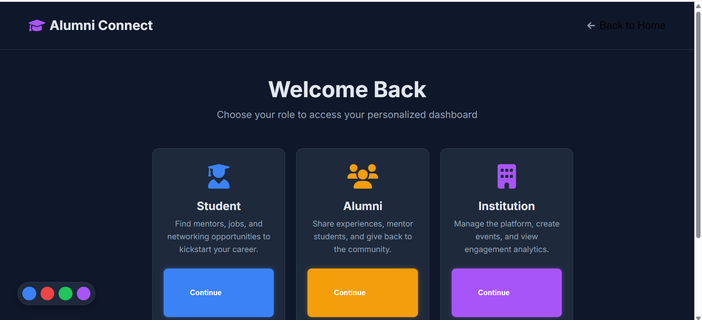

# MENTOR-MESH
Platform that connects alumni, students and institutes. I have made this project for my college level hackathon. This project is consist of many AI features like ai generated interview, ai generated career roadmap with alumni recommendation system. TECK STACK python-flask, mysql, HTML, CSS, javascript.

